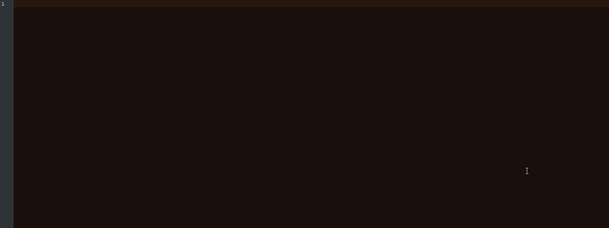

# keystrokes-recorder
Keystrokes recorder for Windows, written in plain WinAPI using keyboard hooks and `PKBDTABLES` returned by `KbdLayerDescriptor` exported by the loaded keyboard layout.

Features:
  - supports every keyboard layout
  - supports changing keyboard layout during typing
  - supports ligatures and dead keys
  - reacts correctly to all modifier keys (alt, ctrl, shift, caps lock etc.)
  - writes recorded keystrokes to a file, along with the window name

In short, whatever text you type in will be recorded in the exact same form.

